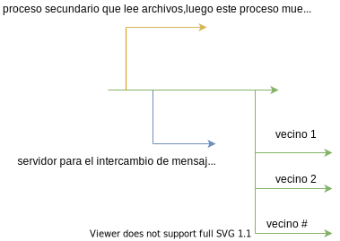
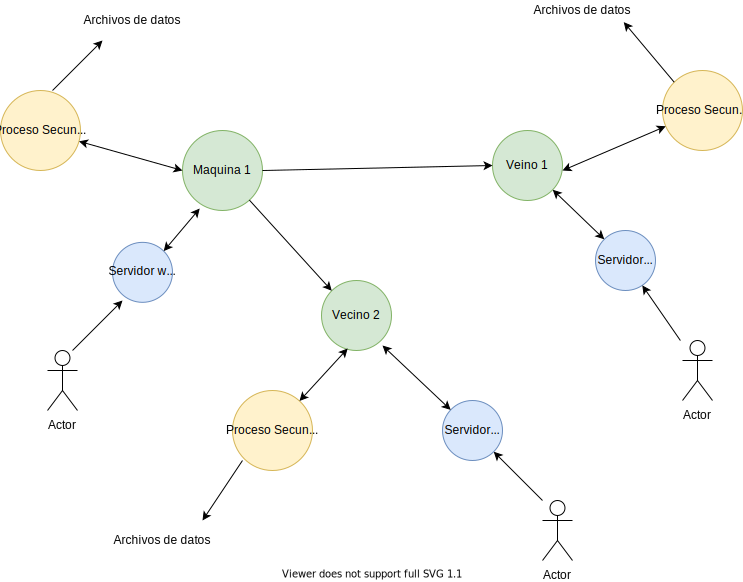

# Análisis del proyecto
## Descripción General
El proyecto consiste en  crear una red de comunicación entre diferentes maquinas la cual va a permitir que las maquinas puedan tanto enviar mensajes a las demás maquinas que se encuentran en la red o recibir mensajes. Las maquinas van a estar conectadas mediante un protocolo demonizado UDP (User Datagram Protocol) el cual es un protocolo para el intercambio de mensajes de mínimo nivel, en otras palabras, es fácil de implementar. Cuando se inicializa una nueva máquina esta va a ejecutar un proceso secundario el cual va a ser el encargado de leer unos archivos que van a describir características de la respectiva maquina como el número de identificaciones número de dirección ip y a cuáles otras máquinas están conectadas la misma. También la maquina va a ejecutar un servidor web el cual va a ser el encargado de manejar los mensajes que se van a enviar o los que se reciben. Los usuarios van a ser los encargados de generar los mensajes y escoger sus destinatarios, estos mediante el uso de un navegador web van a poder establecer una conexión con el servidor web para interactuar con las maquinas conectadas en la red.
## Análisis Fase 1
En la primera fase se va a construir la estructura básica de la red, se va a construir maquinas que sean capaces de arrancar el proceso secundario para obtener sus características y además van a inicializar el servidor web, así como tener una conexión básica con las otras máquinas. Las maquinas solo van a ser capaces de comunicarse con sus vecinos directos en otras palabras, con los cuales tengan una conexión directamente. En esta primera fase no se van a redireccionar los mensajes en el caso de que una maquina reciba un mensaje que no es para ella el mensaje se va a descartar y se va a mostrar una alerta.

## Línea temporal

En la imagen se aprecia como se ejecutan los procesos, primero se inicializa la maquina principal la cual es determinada por el color verde y después se ejecuta el proceso secundario el cual lee los archivos para indicarle las características su respectiva maquina el cual está representado por el color amarillo. Luego se inicializa el servidor web el cual es el representado con la flecha azul, este es el que permite el intercambio de mensajes y al final se realizan las conexiones con los vecinos de la máquina.

## Ejemplo de conexión de la red

La imagen muestra un ejemplo de cómo sería la conexión de red entre las computadoras.

## Dudas sobre el proyecto
¿En las siguientes fases se va a cambiar el protocolo?

¿Por qué el nodo verde no puede leer los archivos el mismo?
